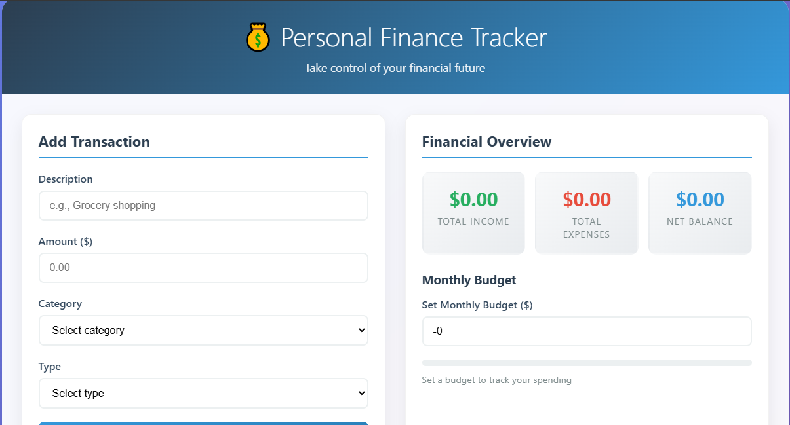
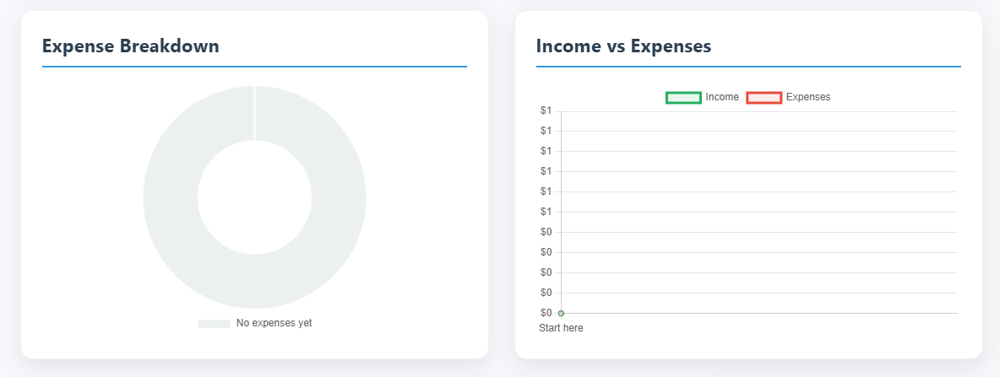

# 💰 Personal Finance Tracker

A beautiful, responsive web application to track your income, expenses, and budgets with real-time analytics and visualizations.


## 🌟 Features

### 💸 Transaction Management
- Add income and expenses with detailed categorization
- Support for multiple categories (Food, Transportation, Bills, etc.)
- Real-time transaction history with easy deletion
- Instant financial calculations

### 📊 Visual Analytics
- **Expense Breakdown Chart** - Interactive doughnut chart showing spending by category
- **Income vs Expenses Trend** - Line chart tracking financial patterns over time
- **Budget Progress Bar** - Visual representation of monthly spending against budget
- **Financial Overview Cards** - Quick stats for income, expenses, and net balance

### 🎯 Budget Tracking
- Set monthly spending budgets
- Real-time progress tracking with color-coded indicators
- Overspending alerts and warnings
- Percentage-based budget analysis

### 🎨 Modern Design
- Glassmorphic UI with gradient backgrounds
- Smooth animations and hover effects
- Fully responsive design (mobile-friendly)
- Color-coded transaction types and categories
- Professional typography and spacing

## 🚀 Live Demo

[View Live Demo](https://your-username.github.io/personal-finance-tracker)

## 📱 Screenshots

### Dashboard Overview


### Add Transaction


### Analytics Charts


### Mobile View


## 🛠️ Tech Stack

- **Frontend**: HTML5, CSS3, JavaScript (ES6+)
- **Charts**: Chart.js v3.9.1
- **Styling**: Custom CSS with CSS Grid & Flexbox
- **Icons**: Unicode emojis
- **Responsive**: Mobile-first design approach

## ⚡ Quick Start

1. **Clone the repository**
   ```bash
   git clone https://github.com/your-username/personal-finance-tracker.git
   cd personal-finance-tracker
   ```

2. **Open in browser**
   ```bash
   # Simply open index.html in your preferred browser
   open index.html
   # or
   python -m http.server 8000  # For local server
   ```

3. **Start tracking!**
   - Add your first transaction
   - Set a monthly budget
   - Watch your financial data come to life

## 📖 How to Use

### Adding Transactions
1. Fill out the transaction form with:
   - **Description**: What the transaction was for
   - **Amount**: Dollar amount (positive number)
   - **Category**: Select from predefined categories
   - **Type**: Choose Income or Expense

2. Click "Add Transaction" to save

### Setting Budgets
1. Enter your monthly budget in the "Set Monthly Budget" field
2. Watch the progress bar update as you add expenses
3. Get visual warnings when approaching or exceeding your budget

### Viewing Analytics
- **Expense Breakdown**: See which categories you spend most on
- **Trend Analysis**: Track income vs expenses over time
- **Budget Progress**: Monitor spending against your monthly goals

### Managing Data
- **Delete Individual Transactions**: Click the ✕ button on any transaction
- **Clear All Data**: Use the "Clear All" button (with confirmation)
- **Data Persistence**: Data is stored in memory during your session

## 🎯 Categories Supported

**Expense Categories:**
- 🍕 Food & Dining
- 🚗 Transportation
- 🛍️ Shopping
- 🎬 Entertainment
- 💡 Bills & Utilities
- 🏥 Healthcare
- 📂 Other

**Income Categories:**
- 💼 Salary
- 💻 Freelance
- 📈 Investment
- 📂 Other

## 🔮 Roadmap & Future Features

- [ ] **Data Persistence** - Local storage integration
- [ ] **Export/Import** - CSV file support
- [ ] **Multiple Budgets** - Category-specific budgets
- [ ] **Savings Goals** - Set and track savings targets
- [ ] **Recurring Transactions** - Automated monthly bills
- [ ] **Reports** - Monthly/yearly financial reports
- [ ] **Dark Mode** - Theme toggle functionality
- [ ] **Multi-currency** - Support for different currencies
- [ ] **Bank Integration** - Import from bank statements
- [ ] **Mobile App** - React Native or PWA version

## 🤝 Contributing

Contributions are welcome! Here's how you can help:

1. **Fork the repository**
2. **Create a feature branch**
   ```bash
   git checkout -b feature/amazing-feature
   ```
3. **Commit your changes**
   ```bash
   git commit -m 'Add amazing feature'
   ```
4. **Push to the branch**
   ```bash
   git push origin feature/amazing-feature
   ```
5. **Open a Pull Request**

### Development Guidelines
- Follow existing code style and formatting
- Test on multiple browsers and screen sizes
- Update documentation for new features
- Keep commits atomic and well-described

## 🐛 Issues & Bug Reports

Found a bug or have a feature request? Please [open an issue](https://github.com/your-username/personal-finance-tracker/issues) with:

- Clear description of the problem
- Steps to reproduce (for bugs)
- Browser and device information
- Screenshots if applicable

## 📄 License

This project is licensed under the MIT License - see the [LICENSE](LICENSE) file for details.

## 🙏 Acknowledgments

- [Chart.js](https://www.chartjs.org/) for beautiful, responsive charts
- [Google Fonts](https://fonts.google.com/) for typography
- The open-source community for inspiration and feedback

## ⭐ Star History

If you found this project helpful, please consider giving it a star! ⭐

---

**Made with ❤️ by [Your Name](https://github.com/your-username)**

*Take control of your financial future, one transaction at a time.*
